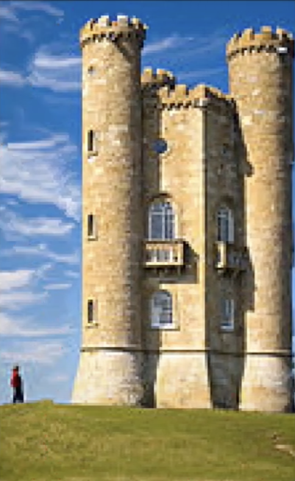

# seam-carving

A small - not very fast or terribly efficient - but very straightforward python implementation of the seam-carving algorithm described in the paper [Seam Carving for Content-Aware Image Resizing](https://perso.crans.org/frenoy/matlab2012/seamcarving.pdf).

### Usage

```python
im = Image.open("images/waterfall.jpg")
grad = ExactGradientMagnitude()

carver = SeamCarver(im, grad)

small_im = carver.carve(n_seams = 50)

plt.imshow(small_im, interpolation="none")
plt.show()

```


### Example output

Before             |  After
:-------------------------:|:-------------------------:
  |  
